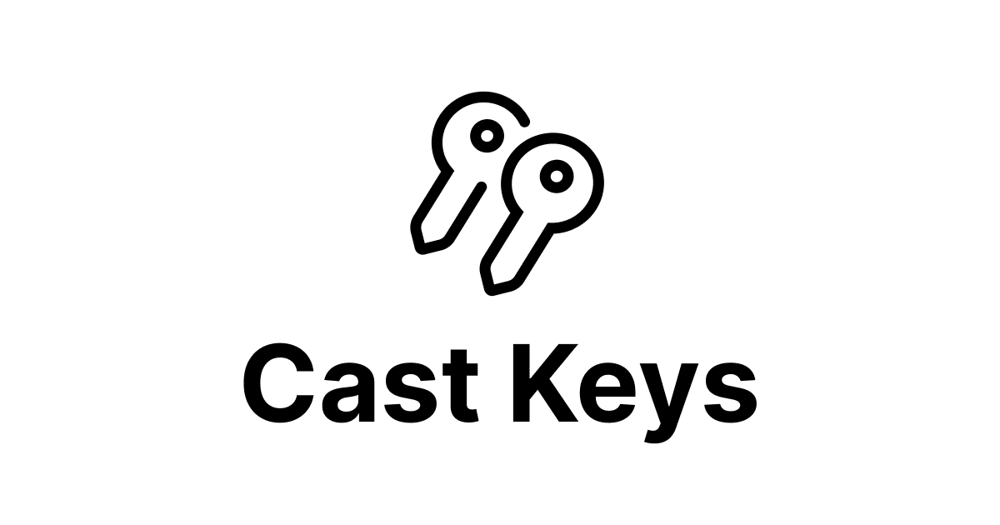

Welcome to the castkeys.xyz repo! This app was designed to be a simple way for Farcaster users to create and own signer keypairs. You can either use the hosted service at [castkeys.xyz](https://castkeys.xyz) or run the app locally!

## Setup

Clone the repo and install dependencies

```
git clone https://github.com/stevedylandev/cast-keys && cd cast-keys && npm i
```

This app uses an `FID` and `MNEMONIC` phrase for either a Farcaster user or app to request the key approval, and more details on the flow / how to get those can be found [here](https://pinata.cloud/blog/how-to-sign-in-with-warpcast/). Rename the `.env.sample` to `.env.local` and fill out the variables

```
DEVELOPER_FID= # the FID of the app or user to request the key approval
DEVELOPER_MNEMONIC= # the mnemonic phrase for the app or user account in the form "word1 word2 word3 etc.."
```

After that you should be able to use the command below and run the app!

```
npm run dev
```
